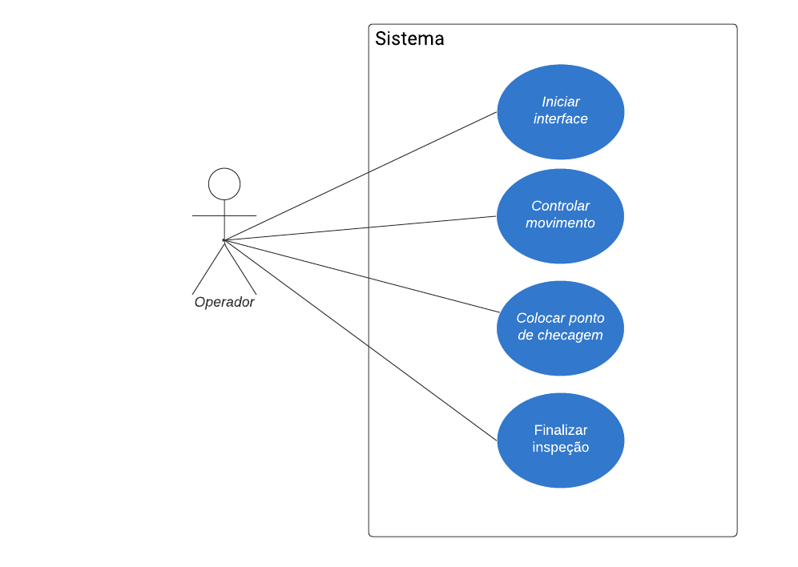

<h1>Projeto SIDEL</h1>

* Data de criação do README: 16/07/2024

<h3>
  
  Guilherme Luis Frandina e Ana Julia Ramalho de Castro</h3>

<h1>Introdução</h1>  

a. Objetivo do projeto
-
  - Desenvolvimento de uma interface de operação e controle inteligente para um drone multi-sensorial, com foco na inspeção de torres de distribuição de energia elétrica.

b. Escopo do projeto
- 
   - MVP (Minimum Viable Product):
     - Uma interface capaz de apresentar as cameras instaladas no drone e que consiga movimenta-lo conforme ordenado pelos botões presentes na tela.
   - Principais entregas do projeto
     - Nenhuma no momento
   - Objetivos do projeto
     - Desenvolver uma interface capaz de monitorar a visão do drone por intermédio de cameras
     - Desenvolver um sistema de telecontrole para situações de necessidade
     - Desenvolver o sistema de comunicação entre os dados do drone e a estação de base
   - Critérios de aceitação do produto
     - Interface que atenda as necessidades do profissional que irá utiliza-la (técnico de inspeção)
   - [Link do protótipo visual no canva](https://www.canva.com/design/DAF-v1TnDdw/y7BZAqdOR8OXGKZ0v_Uoow/edit?utm_content=DAF-v1TnDdw&utm_campaign=designshare&utm_medium=link2&utm_source=sharebutton)  

<h1>Matriz de riscos</h1>

<table>
  <tr>
    <th>Risco</th>
    <th>Probabilidade</th>
    <th>Impacto</th>
    <th>Mitigação</th>

  </tr>
  <tr>
    <td>Atraso na entrega</td>
    <td>4</td>
    <td>5</td>
    <td>Entregar o mais breve possível.</td>

  </tr>
   <tr>
    <td>Não conclusão dos objetivos específicos</td>
    <td>2</td>
    <td>4</td>
    <td>Focar em desenvolver os objetivos mais importantes para o funcionamento do projeto.</td>

  </tr>
    <tr>
    <td>Banca insatisfeita com o projeto</td>
    <td>4</td>
    <td>4</td>
    <td>Realizar os ajustes necessários.</td>

  </tr>
    <tr>
    <td>Reprovação</td>
    <td>3</td>
    <td>5</td>
    <td>Aceitar.</td>

  </tr>
    <tr>
    <td>Limitação tecnológica</td>
    <td>2</td>
    <td>3</td>
    <td>Procurar alguma outra que possa substituir ou que seja próxima o suficiente do desejado.</td>

  </tr>
    <tr>
    <td>Cancelamento do projeto</td>
    <td>1</td>
    <td>5</td>
    <td>Procurar alguma alternativa.</td>
  </tr>
  
</table>

<h1>Quant-UX<h1>
  
[Link do protótipo visual no Quant-UX](https://app.quant-ux.com/#/test.html?h=a2aa10aOGwpjBgfFFBQx0cFbVmsiybto60yOwOMCKFcIyLVSe51ziWE7or3O&ln=en)  

<h1>Diagrama de Atividades</h1>

<h1>Diagrama de Caso de Uso</h1>

<h1> Cronograma </h1>

<table>
  <tr>
    <th>Atividades</th>
    <th>Março</th>
    <th>Abril</th>
    <th>Maio</th>
    <th>Junho</th>
    <th>Julho</th>
    <th>Agosto</th>
    <th>Setembro</th>
    <th>Outubro</th>
    <th>Novembro</th>
    <th>Dezembro</th>
  </tr>
  
  <tr>
    <td>Definição de design da interface</td>
    <td>X</td>
    <td>X</td>
    <td></td>
    <td></td>
    <td></td>
    <td></td>
    <td></td>
    <td></td>
    <td></td>
    <td></td>
  </tr>
  
   <tr>
   <td>Entrega do Pré-Projeto</td>
    <td></td>
    <td></td>
    <td></td>
    <td></td>
    <td>X</td>
    <td></td>
    <td></td>
    <td></td>
    <td></td>
    <td></td>
  </tr>
  
  <tr>
    <td>Defesa Pré Projeto</td>
    <td></td>
    <td></td>
    <td></td>
    <td></td>
    <td>X</td>
    <td></td>
    <td></td>
    <td></td>
    <td></td>
    <td></td>
  </tr>
  
  <tr>
   <td>Implementação dos botões de comando</td>
    <td></td>
    <td>X</td>
    <td>X</td>
    <td>X</td>
    <td></td>
    <td></td>
    <td></td>
    <td></td>
    <td></td>
    <td></td>
  </tr>
  
  <tr>
   <td>Desenvolvimento da comunicação entre o drone e a estação de base </td>
    <td></td>
    <td></td>
    <td>X</td>
    <td>X</td>
    <td>X</td>
    <td>X</td>
    <td></td>
    <td></td>
    <td></td>
    <td></td>
  </tr>
  
  <tr>
   <td>Finalização do primeiro protótipo da interface de controle </td>
    <td></td>
    <td></td>
    <td>X</td>
    <td>X</td>
    <td></td>
    <td></td>
    <td></td>
    <td></td>
    <td></td>
    <td></td>
  </tr>

  <tr>
   <td>Apresentação SCiTec </td>
    <td></td>
    <td></td>
    <td></td>
    <td></td>
    <td></td>
    <td></td>
    <td>X</td>
    <td></td>
    <td></td>
    <td></td>
  </tr>

  <tr>
   <td>Entrega do artigo final </td>
    <td></td>
    <td></td>
    <td></td>
    <td>X</td>
    <td>X</td>
    <td>X</td>
    <td>X</td>
    <td>X</td>
    <td>X</td>
    <td>X</td>
  </tr>

  <tr>
  <td>Apresentação final </td>
    <td></td>
    <td></td>
    <td></td>
    <td></td>
    <td></td>
    <td></td>
    <td></td>
    <td></td>
    <td></td>
    <td>X</td>
  </tr>

</table>

<h1> Organização da equipe </h1>

  
A equipe, juntamente com o orientador, definiu as atividades a serem executadas por meio de uma segmentação de tarefas. Esta abordagem visa garantir uma distribuição eficaz das responsabilidades, permitindo uma gestão mais precisa e focada em cada componente do projeto. O plano prevê a divisão do projeto em três objetivos, correspondentes aos objetivos específicos estabelecidos. Cada um desses objetivos será abordado através de microprojetos, nos quais os membros da equipe se dedicaram de maneira concentrada e especializada.

  
Para garantir um progresso contínuo e alinhado, estão programadas reuniões semanais com o orientador e coorientador. Durante esses encontros, serão apresentados os avanços alcançados em relação aos objetivos estabelecidos, bem como as dificuldades e necessidades identificadas durante a execução de cada microprojeto. Essa troca de informações será fundamental para ajustes, resolução de problemas e otimização dos processos, visando sempre o resultado do projeto como um todo.

<h1> Responsabilidade dos membros da equipe </h1>

- Guilherme

Responsável pelo front end da interface, assegurando a comunicação entre a câmera e a estação base, bem como o funcionamento dos botões de comando. Sua função é crucial para garantir que a interface do usuário seja intuitiva e eficiente, facilitando o controle e monitoramento do drone.
 

- Ana

Responsável pela localização em tempo real do drone e pela disponibilização de informações essenciais para o usuário, como o nível da bateria e sinais de perigo. Sua função é vital para assegurar que o operador do drone esteja sempre ciente da sua posição e das condições operacionais, permitindo uma navegação segura e informada.

<h1> Recursos que serão utilizados </h1>

<table>
  <tr>
    <th>Ferramentas</th>
    <th>Versão</th>
    <th>Localização</th>
    <td>Descrição</td>

  </tr>
  <tr>
    <td> Visual Studio Code</td>
    <td>1.87.2</td>
    <td>https://code.visualstudio.com/</td>
    <td>Editor de código-fonte</td>

  </tr>
   <tr>
    <td>Canva</td>
    <td>-</td>
    <td>https://www.canva.com/pt_br/</td>
    <td>Prototipação das telas e edição de artes para a interface </td>

  </tr>
    <tr>
    <td>Python</td>
    <td>3.10.12</td>
    <td>https://www.python.org/</td>
    <td>Linguagem de programação</td>

  </tr>
    <tr>
    <td>Qt</td>
    <td>5</td>
    <td>https://www.qt.io/qt-for-python</td>
    <td>Biblioteca utilizada para criação de interfaces.</td>

  </tr>
    <tr>
    <td>PyQt</td>
    <td>5</td>
    <td>https://pypi.org/project/PyQt5/</td>
    <td>Framework para criação de interfaces que faz parte da biblioteca Qt.</td>

  </tr>
    <tr>
    <td>Ubuntu</td>
    <td>22.2 LTS</td>
    <td>https://ubuntu.com/</td>
    <td>Sistema operacional.</td>

  </tr>
</table>

<h1>Resultados esperados</h1>

Tanto o SIDEL quanto o projeto que está sendo realizado no LaRCA estão diretamente interligados, uma vez que, este projeto tem como responsabilidade o desenvolvido da interface de operação e controle inteligente para o drone que está sendo desenvolvido no Laboratório de Robótica e Computação Aplicada. Dessa forma, ao finalizar um projeto, o outro também será concluído, por conta disso, os resultados esperados vão além dos citados nos objetivos específicos, se tornando mais abrangente e tendo um impacto social que busca:

- Maior segurança durante a operação de drones durante a inspeção
  
- Diminuição no custo operacional
  
- Aumento de produtividade

