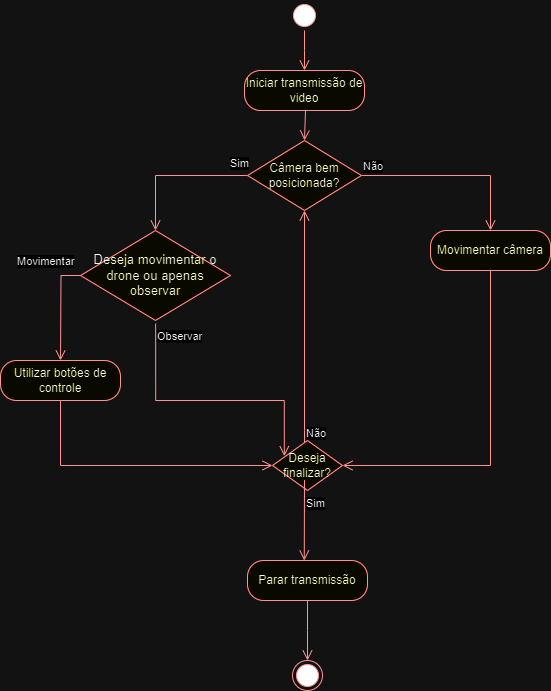

<h1>Projeto SIDEL</h1>

* Data de criação do README: 16/07/2024

<h3>
  
  Guilherme Luis Frandina e Ana Julia Ramalho de Castro</h3>

<h1>Introdução</h1>  

a. Objetivo do projeto
-
  - Desenvolvimento de uma interface de operação e controle inteligente para um drone multi-sensorial, com foco na inspeção de torres de distribuição de energia elétrica.

b. Escopo do projeto
- 
   - MVP (Minimum Viable Product):
     - Uma interface capaz de apresentar as cameras instaladas no drone e que consiga movimenta-lo conforme ordenado pelos botões presentes na tela.
   - Principais entregas do projeto
     - Nenhuma no momento
   - Objetivos do projeto
     - Desenvolver uma interface capaz de monitorar a visão do drone por intermédio de cameras
     - Desenvolver um sistema de telecontrole para situações de necessidade
     - Desenvolver o sistema de comunicação entre os dados do drone e a estação de base
   - Critérios de aceitação do produto
     - Interface que atenda as necessidades do profissional que irá utiliza-la (técnico de inspeção)
   - [Link do protótipo visual no canva](https://www.canva.com/design/DAF-v1TnDdw/y7BZAqdOR8OXGKZ0v_Uoow/edit?utm_content=DAF-v1TnDdw&utm_campaign=designshare&utm_medium=link2&utm_source=sharebutton)  

<h1>Quant-UX<h1>
  
[Link do protótipo visual no Quant-UX](https://app.quant-ux.com/#/test.html?h=a2aa10aOGwpjBgfFFBQx0cFbVmsiybto60yOwOMCKFcIyLVSe51ziWE7or3O&ln=en)  

<h1>Diagrama de Atividades</h1>

